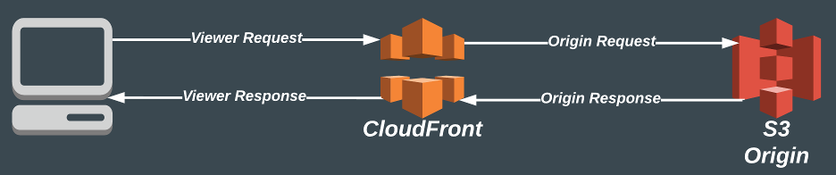

# Running Lambda @ the Edge
In this project I will present my different experiments that I have done running Lambda functions @ CloudFront Edge locations.  

## Limitations
The Lambda function have some limitations. Max memory size is 128mb and the timeout for the function is 5 seconds. The function must be deployed in us-east-1 region for CloudFront to be able to fetch it. CloudFront can only use fixed versions of the function. You can't use $LATEST

 ## Events from CloudFront
 CloudFront can call our Lambda in 4 points:
 
   
- ### Viewer Request
  - This event trigger before CloudFront checks if the requested object is in the cache. If you like your Lambda function to execute for every request use this.

- ### Origin Request
  - This event trigger when CloudFront forwards the request to the origin. So if the object is in the cache the Lambda function will not execute.

- ### Origin Response
  - This event trigger when CloudFront receives a response from the origin but prior to adding it to the cache. The event is triggered even if the the response is an error. The event will not trigger if the object is already in the cache or if the object was generated by an Lambda function triggered by a Origin Request event.

- ### Viewer Response
  - This event trigger prior to CloudFront returns an object to the client. There are some circumstances when the event is not triggered.
    - If the origin returns a status code 400 or higher
    - If a custom error page is returned
    - If the response was generated by a View Request event
    - When CloudFront automatically redirect from Http to Https.

## Debugging
Logs generated by the Lambda function is stored in CloudWatch, as normal, but they are stoed in the region closest to the client. So even that the function it self is in us-east-1 the logs are spread all over the region. This can make debugging a bit difficult.  
A way to solve this would be to create a logsubscription and stream the logs to S3 using Kinesis.

# Experiments in this repo
All of the experiments can easily be deployed in your account using the cloudformation templates.

# CloudFront acting as simple webserver

CloudFront can't act as webserver. It's possible to point out a defualt index file but that is only applicable for the root url.  
  
Specifying index.html as your default index file would only kick in when navigating to e.g. www.example.com but sub urls like www.example.com/sub/ would not work and CloudFront wouldn't fetch index.html from the sub folder.  
  
## Solution with Lambda
To solve this it's possible to have a Lambda function triggered with one of the events to replace the requested url and return the proper index file. Since we don't like this to run on all request, we would like responses to be cached we trigger on Origin Request event.

# Viewer based content

Depending on what client device that is requesting a file you might like to return different versions. Instead of having each client requesting the different files CloudFront could return different versions.

## Solution with Lambda
To accomplish this let a Lambda function trigger for the origin-request event. This will allow CloudFront to cache the result and to be able to add custom headers cloudfront-is-*-viewer and cloudfront-viewer-country. To be able to get these headers in the event we must setup CloudFront to cache these headers.  
When the Lambda function then is triggered the url can be rewritten to fetch content based on these headers.